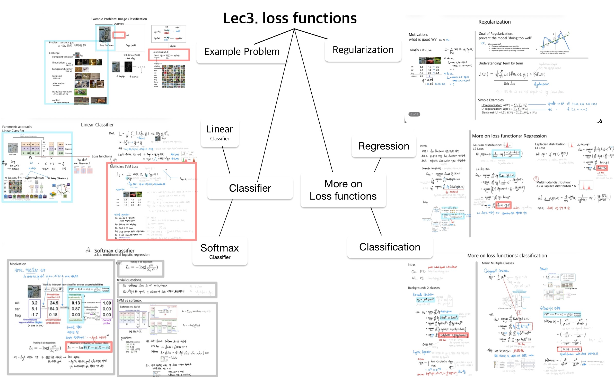

## AI Experience Lab

### Notice
- Some figures are adapted from lecture materials.   
- For personal study purposes only. 
- Unauthorized reproduction and monetization are prohibited.

### Source
- AI Experience Lab Lecture, Fall 2023, Prof. Ue-Hwan Kim [link](https://uehwan.github.io/teaching/aiexplab23fall/)
- Stanford CS231n [link](https://cs231n.stanford.edu/)

### Google Colab
you can access the google colab implementation here:    
- [lec1 perliminary](https://colab.research.google.com/drive/1E1wPIM3WUZk3O9Oc5Zc7JOcPNl6chOUA?usp=sharing)   
- [lec2 perceptrons](https://colab.research.google.com/drive/12bugh7xUMNWkoTVZRC96zqhiHGGYWH1h?usp=sharing)   
- [lec3 loss functions](https://colab.research.google.com/drive/1sZio1b-95b3VknErdUh3Pr6fzbt5ON9C?usp=sharing)   
- [lec4 back propagation](https://colab.research.google.com/drive/1G-x3-GDtdBZNlqE1mlwz9e3BmdveNPRp?usp=sharing)   
- [lec5 optimization](https://colab.research.google.com/drive/10hjPE5_TG-Hl3v3XWw8SPUjR3y8RwwwV?usp=sharing)   
- [lec6 CNNs](https://colab.research.google.com/drive/1Rmcddb66Ba35uhIFV-YxinN4y2EjeQhT?usp=sharing)   

### LectureNote
- you can access the lecturenote summary on pdf.  
- Here is an example(lec3 loss functions)
