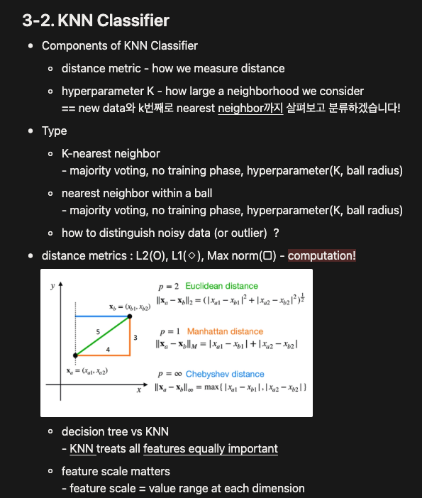

# Machine Learning and Deep Learning

### Notice
- Some figures are adapted from lecture materials.   
- For personal study purposes only. 
- Unauthorized reproduction and monetization are prohibited.

### Source
- Machine Learning and Deep Learning Lecture, Spring 2023, Prof. Jeany Son

### LectureNote
- you can access lecture note summary here: [link](https://www.notion.so/MLDL-LectureNote-1295249e0be24919b527df0abbfa573a?source=copy_link)  
- Here is an example:   
